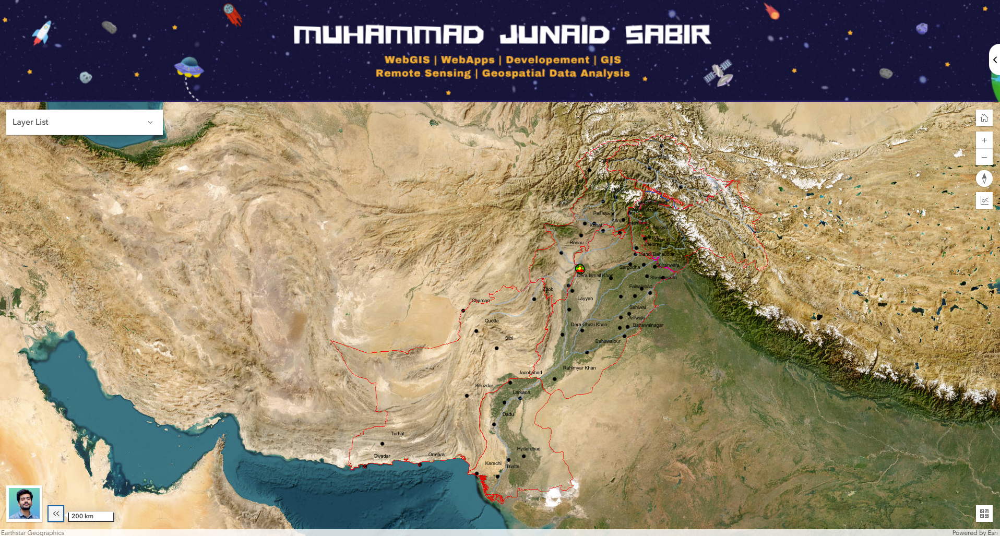
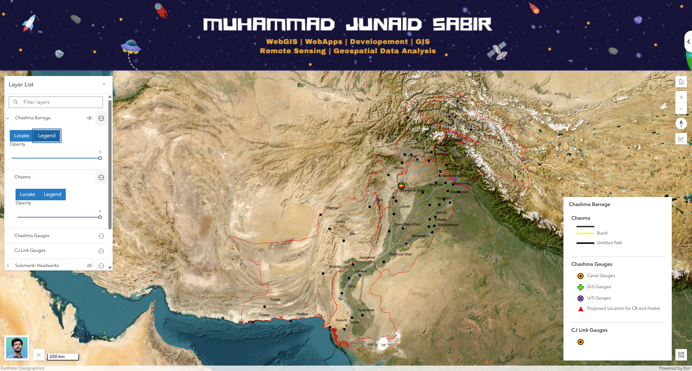
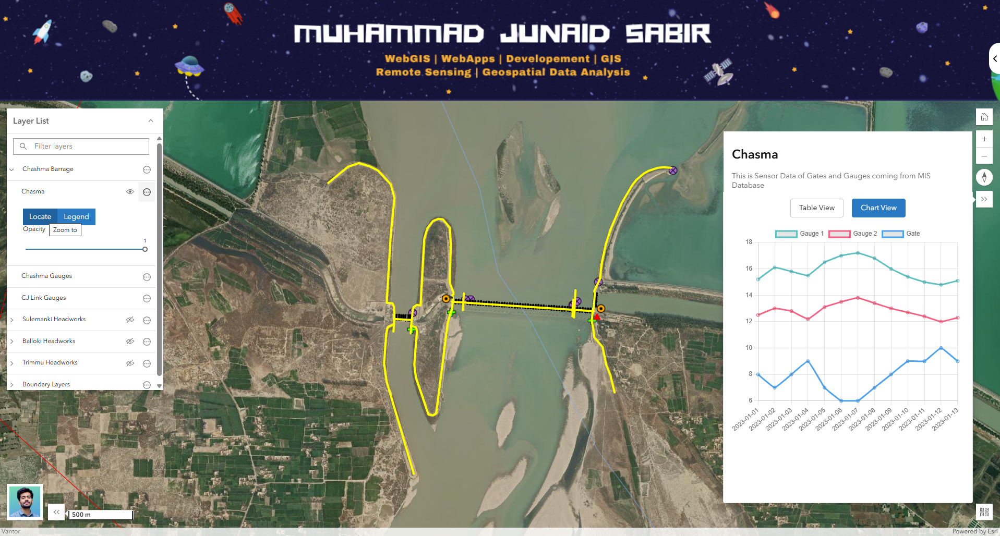

# Web GIS Application

PROJECT: "INSTALLATION OF TELEMETRY SYSTEM FOR REAL TIME DISCHARGE MONITORING AT 27 KEY SITES ON INDUS BASIN IRRIGATION SYSTEM (IBIS)"
This is a web-based GIS application that allows users to visualize and interact with spatial and SQL data. It's designed to showcase Advance WebGIS functionalities of ArcGIS API in a user-friendly interface.

## Live Demo

This Webapp is under development for the IRSA (INDUS RIVER SYSTEM AUTHORITY) - All Provincial Water Related Ministries and WAPDA.

## Features

*   **Interactive Map:** Users can pan, zoom, and interact with the map.
*   **Home Mapview:** User can go back to the default Mapview of the webapp using Home Button.

### Initial Map View

*   **Layer Controls:** Highly Custumized Layerlist Panel containing Change Opacity, Zoom to Layer, and Toggle Legends On and Off functions.

### Legends Toggle

*   **Data Fetching:** Fetch and display any type of store or live data from a SQL database.
*   **Expandable Results:** View fetched data in an expandable and well-organized result panel.

### Fetched SQL Data

## Key Features

*   **Interactive Map:** Built with the ArcGIS API for JavaScript, allowing for smooth panning, zooming, and exploration of spatial data.
*   **Dynamic Layer Control:** A layer list widget allows users to toggle the visibility of different map layers and groups of layers.
*   **Data-driven Popups:** Clicking on map features opens informative pop-ups with details about the selected feature.
*   **Informative Legends:** A legend widget helps users understand the symbols used on the map.
*   **Basemap Switching:** Users can switch between different basemaps (e.g., satellite, street) to suit their needs.
*   **Data Visualization:** Fetched data can be viewed in both a paginated table and an interactive line chart.
*   **Responsive Design:** The application is designed to work on different screen sizes, from desktops to mobile devices.

## GitHub Page Link
[Link](https://m-junad-sabir.github.io/IBIS-IRSA-custumized-webgis/)

## Built With

*   [ArcGIS API for JavaScript](https://developers.arcgis.com/javascript/latest/) - For creating interactive maps and GIS functionality.
*   HTML
*   CSS
*   JavaScript

The Real Application is developed in .NET 8 -- ASP.NET Framwork with C# Language to GET Data from SQL Server Database.

## Setup and Installation

1.  Clone the repository
2.  Add your Own Published GIS Layers on ArcGIS Server
3.  Change Header Image and LogoDiv Image
4.  Make Backend using any backend language and make Database to show data in the Result Panel
5.  Program your code to connect your backend code to javascript code so that your data can be GET in the Result Panel
6.  Open `index.html` in your web browser

## License

This project is licensed under the [MIT License](./LICENSE).
